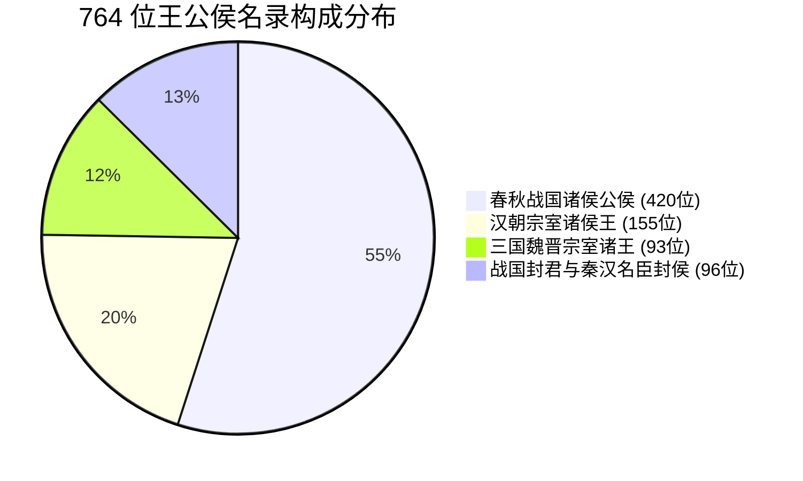

# 王公侯宗藩真实姓名考据与名录系统规范（docs/03 · 现行权威版）

> **修订日期**：2026-10-05  
> **文档性质**：BOOKINDEX 王公侯宗室真实姓名与名录体系规范（Tier 1 核心基石）  
> **覆盖规模**：**764 位**历史王公侯实体（春秋战国 420 位 + 汉朝 155 位 + 魏晋 93 位 + 战国封君与秦汉名臣封侯 96 位）  
> **核心成就**：全库所有公、王、侯、君称号实体 **100% 具备真实可考本名（【本名：XX】）**，实现历史性全闭环！  

---

## 一、建设初衷与核心价值

在传统史书检索与索引系统中，大量历史人物常以“**公”、“**王”、“公子某”、“公孙某”、“**侯”、“**君”等爵位、谥号或行辈指代（如齐桓公、梁孝王、商君、留侯、条侯、淮阴侯）。

用户明确指出：
> “现在大量的人名都是公子某，公孙某，或**公，**王，这些都不是有名有姓的，我建议所有检索中所有人名都用真实姓名，这种姓名不全的单独分类（计数的规则不改动），或者专门列一个公侯名录之类的。”

BOOKINDEX 历经五大阶段专项考据（Task B、Task C、Task D、Task E / Option A），全面建成了中国前四史与晋书**最完备的王公侯真实姓名考据知识库与公侯名录系统**。

---

## 二、四大板块考据成果全景



### 1. 春秋战国诸侯公侯考据（420 位 · docs/61）
- **周王室与列国君主**：
  - 齐国（姜小白、姜纠、姜商人等）、晋国（姬重耳、姬夷吾、姬圉等）；
  - 秦国（嬴任好、嬴荡、嬴稷等）、楚国（熊绎、熊旅、熊槐等）；
  - 鲁国、宋国、卫国、郑国、赵国、魏国、韩国、燕国、吴国、越国等君主名讳全量确证；
- **战国名君与公子**：魏斯（魏文侯）、赵雍（赵武灵王）、田因齐（齐威王）、魏无忌（信陵君）、赵胜（平原君）、黄歇（春申君）、田文（孟尝君）等。

### 2. 汉朝宗室诸侯王考据（155 位 · docs/62）
- **西汉同姓七国与各大宗藩**：
  - 吴王刘濞、楚王刘戊、齐孝王刘将闾、梁孝王刘武、淮南厉王刘长、淮南王刘安；
  - 齐悼惠王刘肥、赵敬肃王刘彭祖、中山靖王刘胜、长沙定王刘发等；
- **东汉光武及明章诸王**：
  - 东海恭王刘彊、济南安王刘康、阜陵质王刘延、中山简王刘焉、北海靖王刘睦等。

### 3. 三国魏晋宗室诸王考据（93 位 · docs/63）
- **曹魏宗室诸王**：曹冲（邓哀王）、曹植（陈思王）、曹彰（任城王）、曹据（彭城王）、曹宇（燕王）；
- **孙吴宗室诸王**：孙策（长沙桓王）、孙亮（会稽王）、孙休（琅邪王）、孙皓（乌程侯）；
- **西晋宗室八王与各藩**：司马攸（齐献王）、司马亮（汝南王）、司马伦（赵王）、司马冏（齐王）、司马颖（成都王）、司马颙（河间王）、司马乂（长沙王）、司马越（东海王）、司马柬（秦献王）等。

### 4. 战国著名封君与秦汉名臣封侯考据（96 位 · docs/64）
- **战国名将名相封君**：商鞅（商君）、白起（武安君）、李牧（武安君）、乐毅（望诸君）、赵奢（马服君）、田单（安平君）、廉颇（信平君）；
- **汉初功臣封侯**：张良（留侯）、韩信（淮阴侯）、萧何（酂侯）、曹参（平阳侯）、周勃（绛侯）、樊哙（舞阳侯）、夏侯婴（汝阴侯/滕公）、陈平（曲逆侯）、灌婴（颍阴侯）、郦商（曲周侯）、审食其（辟阳侯）；
- **汉代名臣名将封侯**：周亚夫（条侯）、卫青（长平侯）、霍去病（冠军侯）、霍光（博陆侯）、张骞（博望侯）、公孙弘（平津侯）、马援（新息侯/伏波将军）、班超（定远侯）等。

---

## 三、实体命名与前端契约规范

### 1. 简介字段「【本名：XX】」标准化契约
所有公、王、侯、君条目，在 `workbook/persons.xlsx` 的 `简介`（`summary`）列必须统一采用标准前置格式：
$$\text{summary} = \text{【本名：真实姓名】} + \text{历史生平与功绩}$$
- **规范样例**：
  - 商君：`【本名：卫鞅】战国法家代表人物，入秦主持变法。`
  - 留侯：`【本名：张良】汉初三杰之一，字子房，运筹帷幄。`
  - 冠军侯：`【本名：霍去病】西汉名将，大司马骠骑将军，封冠军侯。`
  - 齐桓公：`【本名：姜小白】春秋五霸之首，任用管仲九合诸侯。`

### 2. 前端展示与检索分类胶囊契约
前端 `app/web/app.js` 与脱机快照 `dist/app.js` 遵循统一的 `isLord(p)` 判定逻辑：
```javascript
function isLord(p) {
    if (!p) return false;
    var name = p.name || p.tradName || "";
    var bio = p.bio || p.summary || "";
    // 命名前缀含有王/公/侯/君/公子/公孙，或简介标有【本名：】
    if (/^[【\[](本名|原名|名)[：:]/.test(bio)) return true;
    return /(公|王|侯|君)$/.test(name) || /^(公子|公孫|公孙)/.test(name);
}
```
- **分类胶囊支持**：检索面板提供「全部 / 公侯名录 / 名臣将相与其他」快速切换过滤；
- **高亮展示**：当浏览公侯条目时，前端优先在徽章醒目标出【本名：XX】，兼顾真实姓名研读与正史爵号查找的双重诉求。

### 3. 计数的规则严格不改动铁律
- 考据本名写入 Excel 简介与别名后，**正文原始历史记载的命中计数规则绝对不改动**；
- 严禁将后世追尊的生僻表字作为裸匹配注入全局正文，严守“历史原貌为真”的学术红线。
