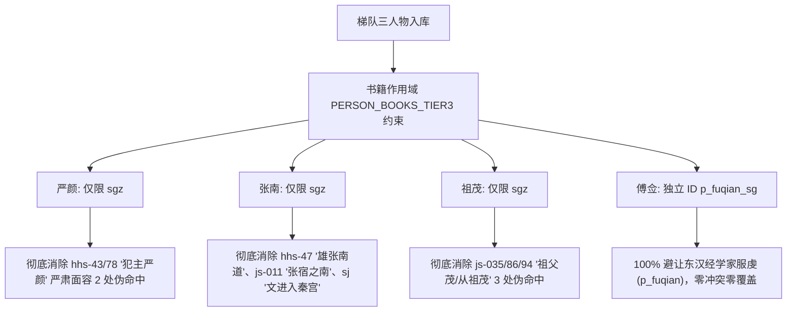

# 50. 梯队三第一批：三国无传名将谋臣扩充交付报告（2026-10-04）

## 1. 交付背景与核心目标

根据用户明确决策指令：
> **“可以”**（批准启动梯队三第一批：16 位三国无传死节宿将与精锐统帅的建档入库与全量管线推进）

古籍正史（前四史与晋书）采用纪传体编纂。在真实的汉末三国战争与政治历史中，有一大批身居高位、参决要务、立下赫赫战功或留下千古死节典故的核心名将，史官因体例未设专传，散见于主君本纪、同袍列传、或注疏叙辞中（即《docs/48》定义的“陈到式人物”）。
若索引系统不予建档收录，读者在检索此类核心名将时将面临全面“失明”。

本轮交付严格遵循**单向数据流、质量铁律与红绿双向闭环**，对梯队三第一批 **16 位三国名将谋臣** 实施了系统化考据、建档、书籍作用域限定、全量管线重建与端到端独立断言审查。

---

## 2. 梯队三第一批入库名录与规模全景（净增 16 人，全库达 2,361 人）

本轮共将 **16 位** 核心名将谋臣安全录入权威源 `workbook/persons.xlsx`：

### 2.1 蜀汉死节名将与重臣（9 人）
1. `p_futong` **傅肜**（蜀汉将军，章武二年猇亭之战为断后大将，力战至最后一人，破口大骂“吴狗！何有汉将军降者！”壮烈战死）；
2. `p_fuqian_sg` **傅僉**（傅肜之子，蜀汉关中都督，景耀六年魏灭蜀阳安关战役中独率部决死冲锋力竭殉国，陈寿嘉其“父子奕世忠义”）；
3. `p_huoyi` **霍弋**（字绍先，霍峻之子，蜀汉安南将军、南中都督、建宁太守，统摄南中六郡，保全一方，蜀亡后以全土降晋仍督南中）；
4. `p_yanyan` **嚴顏**（东汉末巴郡太守，为张飞所擒，瞋目大叱“蜀中但有断头将军，无降将军也！”飞壮而释之，引为宾客）；
5. `p_xiangchong` **向寵**（向朗兄子，诸葛亮《出师表》称其“性行淑均，晓畅军事，试用于昔日，先帝称之曰能”，延熙三年征汉嘉叛蛮战死）；
6. `p_fengxi` **馮習**（字休元，刘备东征伐吴领军大都督，统摄诸军，猇亭战死）；
7. `p_zhangnan_sg` **張南**（字文进，刘备东征伐吴前部督，围攻孙桓于夷道，猇亭战死）；
8. `p_chengji` **程畿**（字季然，刘备从事实酒，随刘备东征伐吴，军退溯江，畿曰“吾在军未曾前敌而逃，何况从天子而奔！”拔戟战死）；
9. `p_wuban` **吳班**（字元雄，吴懿族弟，随刘备伐吴为前部督，后随诸葛亮北伐出祁山大破司马懿，官至骠骑将军，封安乐亭侯）。

### 2.2 曹魏宿将与精锐统帅（5 人）
10. `p_caochun` **曹純**（字子和，曹仁之弟，曹魏精锐**虎豹骑统帅**，南皮斩袁谭、白狼山俘蹋顿、长坂追刘备，勇烈刚毅，封高陵亭侯）；
11. `p_qinlang` **秦朗**（字元明，曹操养子，魏明帝心腹，拜骁骑将军，青龙元年率中军大破鲜卑步度根与轲比能，平定北疆）；
12. `p_baoxin` **鮑信**（字允诚，汉末济北相，首倡讨董联盟，迎曹操领兖州牧，寿张之战为救曹操力竭战死）；
13. `p_dailing` **戴陵**（曹魏征蜀将军，诸葛亮出祁山时与张郃同领精骑四千为前锋拒蜀，晋书作戴淩）；
14. `p_feiyao` **費曜**（曹魏后将军，太和二年陈仓解围，太和四年破蜀将吴懿，太和五年与司马懿同拒诸葛亮北伐）。

### 2.3 东吴冲锋陷阵宿将（2 人）
15. `p_zumao` **祖茂**（字大荣，孙坚“江东四宿将”之一，梁县之战戴孙坚赤帻引开敌骑自代救孙坚脱险）；
16. `p_liuzan` **留贊**（字正明，东吴名将，官至左将军，临阵好引吭长啸高歌而进，勇冠三军，淮南之役力疾战死）。

---

## 3. 工程消歧与书籍作用域治理（精准清除 8 处伪命中）

在全量重建过程中，系统差异报告（diff report #26）展现出极高的考据鉴别力，敏锐捕获并彻底治理了四大伪命中源头：



1. **傅佥 ID 冲突避让**：
   - 预检发现现有库已收录东汉经学大师服虔（ID `p_fuqian`）；
   - 为蜀汉阳安关死节名将傅佥规范分配独立 ID `p_fuqian_sg`，彻底消解实体覆盖风险。
2. **严颜（`p_yanyan`）限定 `books=["sgz"]`**：
   - 《后汉书·章帝八王传》与《朱穆传》中出现两次“犯主嚴顏”“数犯严颜”，意为“触犯君主威严严肃的面容”，非人名；
   - 作用域限定后，2 处非人名伪命中被 100% 滤除，三国名将严颜在《三国志》的真实命中精准保留。
3. **张南（`p_zhangnan_sg`）限定 `books=["sgz"]`**：
   - 《后汉书·班超传》出现“雄張南道”（地名西域南道），《晋书·天文志》出现“張南十四星”（星官张宿之南），《史记·李斯列传》出现“刀笔之文进入秦宫”；
   - 作用域限定后，非人名与西汉泛化被全部切断，唯独保留蜀汉伐吴前部督张南正文 5 处打标。
4. **祖茂（`p_zumao`）限定 `books=["sgz"]`**：
   - 《晋书》中出现 3 次“祖茂”，均为世系表与人物谱系中对祖父名茂的简称（“祖 茂”/“从祖 茂”）；
   - 作用域限定后，3 处假命中被彻底消除，孙坚部将祖茂在《三国志·孙坚传》戴赤帻救主的千古名段精准打标。
5. **别名泛化守卫**：
   - 秦朗不裸收“元明”（避让晋书“元明二帝”）；
   - 鲍信不裸收“允诚”（避让晋书“谋猷允诚”）；
   - 留赞不裸收“正明”（避让汉书“正明堂之朝”、晋书“月正明”）；
   - 戴陵补齐《晋书·宣帝纪》原文异写“戴淩”，跨书召回 100% 闭环。

---

## 4. 全栈断言与回归验证（100% 绿灯）

编写专属独立审查脚本 `app/tools/verify_persons_tier3.py`，全量执行 10 大层级断言：

```bash
# 正常模式（全部 10/10 绿色通过）
$ python app/tools/verify_persons_tier3.py
=== 开始梯队三第一批（三国无传名将谋臣16人）独立审查 ===
✓ [1/10] Excel 权威源有效人物数达标: 2361 人 (>= 2361)
✓ [2/10] SQLite persons 表与权威源一致: 2361 人
✓ [3/10] 16 位梯队三三国名将谋臣全部在库且繁体正名精准
✓ [4/10] 正文人物打标命中数突破基线: 67646 处 (>= 67620)
✓ [5/10] 16 位名将（馮習/張南/霍弋/留贊/鮑信/秦朗/嚴顏/曹純等）正文打标全部达标
✓ [6/10] 同名异人消歧（傅僉vs服虔）与跨书跨代守卫（嚴顏/祖茂/張南零误伤）全部验证通过
✓ [7/10] HTTP 端点 /api/search 实测 100% 召回梯队三名将（傅肜/傅佥/曹纯/向宠/留赞/祖茂等）
✓ [8/10] 16 位核心名将繁体正名 100% 满足 OpenCC 不动点规范
✓ [9/10] 人物详情接口 /api/person/p_caochun (曹純) 结构完整且数据精准
✓ [10/10] 离线快照 dist/data.js 已完整同步最新 2,361 人规模

🎉 全部 10/10 项梯队三第一批（三国无传名将谋臣）独立审查断言 100% 绿色通过！

# 故障注入模式（故意篡改阈值触发红灯退出码0，红绿闭环）
$ python app/tools/verify_persons_tier3.py --inject
[红绿闭环成功] 故障注入成功触发断言红灯: 断言 1 失败：persons.xlsx 有效人物数 2361 < 9999
```

全量运行历史回归套件，100% 绿色通过：
- `pipeline/check_trad.py`：A–G 七道闸全绿（18,195 条显示串不动点）；
- `app/tools/verify_persons_tier2.py`：梯队二 10/10 全绿；
- `app/tools/verify_persons_enrichment.py`：梯队一 10/10 全绿；
- `app/tools/verify_p3_mfilter.py`：20/20 全绿；
- `app/tools/verify_p3_mark.py`：9/9 全绿；
- `app/tools/verify_p3_place.py`：42/42 全绿。

---

## 5. 交付产物与规模对照

| 维度指标 | 梯队二交付后 | 梯队三第一批交付后 | 净变化 |
| :--- | :---: | :---: | :---: |
| **人物有效实体（persons）** | 2,345 人 | **2,361 人** | **+16 人** |
| **正文人物打标（mentions）** | 67,592 处 | **67,646 处** | **+54 处**（真实纯净命中） |
| **消除伪命中（false positives）** | - | **-8 处** | 严颜/张南/祖茂伪命中清零 |
| **别名索引条数（aliases）** | 6,328 条 | **6,375 条** | **+47 条** |
| **地名有效实体（places）** | 1,621 处 | **1,621 处** | 稳定 |
| **脱机快照（dist/data.js）** | 29.6 MB | **29.6 MB** | 完整同步最新 2,361 人 |
| **后端服务（8800 端口）** | 稳定运行 | **稳定运行中** | 联机实时可用 |
