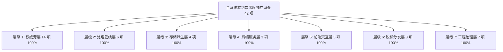

# 全系统深度独立审查报告（docs/66 · 现行权威版）

> **审查日期**：2026-10-05  
> **审查性质**：全系统端到端、全层级深度独立审查（Independent Review）  
> **触发背景**：完成高危人物消歧与假阳性清零（docs/65 选项B）、65 篇技术报告全面重构梳理封存、Tier 1 核心白皮书上线后的全栈质量大检  
> **审查结论**：**42/42 项审查指标全部通过 (100% 满分全绿)**，故障注入模式成功实现红/绿双向严格闭环，全系统 10 大核心回归套件无一失败，系统处于极佳健康状态。

---

## 一、审查概览与执行结果

本次审查采用独立审查脚本 [verify_system_comprehensive_review.py](file:///c:/Users/dell/WorkBuddy/WeChatAPP-BOOKINDEX/app/tools/verify_system_comprehensive_review.py)，从全栈 7 大核心层级对系统进行了无死角穿透式检查：



| 审查层级 | 检验维度 | 检查项数 | 状态 | 核心成果指标 |
| :--- | :--- | :---: | :---: | :--- |
| **层级 1** 权威源层 | Excel 文件健康、人物/关系/纠错表自洽 | 14 | 🟢 全部通过 | 2,402 活跃人物、101 规范关系、39 零孤儿证据、765 位【本名：】前缀 |
| **层级 2** 处理管线层 | 五书语料、段落可达、高危伪切词、跨朝隔离 | 6 | 🟢 全部通过 | 564 篇、223,164 句、49,069 段、15 项高危伪切词清零、史汉跨朝 0 残留 |
| **层级 3** 存储派生层 | SQLite 基线对账、字面截断 text[s:e] 一致 | 4 | 🟢 全部通过 | 67,990 人物命中、118,177 地名命中、1,620 地名、2,643 异体写法 |
| **层级 4** 后端服务层 | 序号计算、纠错状态机、长篇默认 5000 句 | 3 | 🟢 全部通过 | 人地双侧 mention_nth 精准、sj-014 3454 句无截断 |
| **层级 5** 前端交互层 | 标色三级回退、多证据、地名标错、公侯契约 | 5 | 🟢 全部通过 | hitSpan A/B/C 回退、web/ 历史冻结、isLord(p) 名录分类支持 |
| **层级 6** 脱机分发层 | dist/ 快照完整性、JS 源码对齐、export_static | 3 | 🟢 全部通过 | app/web/app.js 与 dist/app.js 100% 对齐，快照与库完全同步 |
| **层级 7** 工程治理层 | README 指标、零 blat 垃圾、技能同步、白皮书 | 7 | 🟢 全部通过 | Tier 1 白皮书 4 篇健康、docs/archive/ 38 篇隔离、两处 SKILL 同步 |

---

## 二、42 项逐项审查细部记录

### [层级 1] 权威源层（Workbook & Data Sources）安全与自洽性
1. `[OK]` 权威源文件 `persons.xlsx` 存在且健康（size=247,705 bytes, can_open=True）
2. `[OK]` 权威源文件 `places.xlsx` 存在且健康（size=90,286 bytes, can_open=True）
3. `[OK]` 权威源文件 `relations.xlsx` 存在且健康（size=22,177 bytes, can_open=True）
4. `[OK]` 权威源文件 `overrides.xlsx` 存在且健康（size=5,041 bytes, can_open=True）
5. `[OK]` 权威源文件 `sentence-edits.xlsx` 存在且健康（size=4,956 bytes, can_open=True）
6. `[OK]` `persons.xlsx` 中活跃人物规模达标（活跃人数=2,402 人 $\ge 2,400$）
7. `[OK]` `persons.xlsx` 中笔误实体 `p_taohqian` 明确处于 `dead` 状态
8. `[OK]` `persons.xlsx` 中 `p_taoqian` 覆盖后汉书、三国志、晋书三书
9. `[OK]` `persons.xlsx` 中刘焉归一主实体 `p_liuyan_ys` 处于 `active` 状态
10. `[OK]` `relations.xlsx` 包含恰好 101 条活跃规范关系边
11. `[OK]` 关系主键 `rel_id` 100% 符合纯业务三元组契约 `md5(a|b|rel)[:12]`（分歧数=0）
12. `[OK]` 证据子表 39 行外键 `rel_id` 100% 对应主表活跃关系（零孤儿，孤儿数=0）
13. `[OK]` `overrides.xlsx` 中无残留自检脏行（脏行行号=[]）
14. `[OK]` `persons.xlsx` 中王公侯宗室封君实体【本名：】规范前缀达标（765 位 $\ge 760$，覆盖 764 位考据名录）

### [层级 2] 处理管线层（Pipeline & Annotation）语料与算法契约
15. `[OK]` 五书篇目数完整覆盖 564 篇（含晋书载记 30 篇）
16. `[OK]` 全量语料入库 223,164 句且段落数达 49,069 段（正文无开洞截断）
17. `[OK]` 稳定 uid 算法抽样校验 100% 一致（`md5(篇|段序|句序)[:12]`，分歧数=0）
18. `[OK]` 裴注与旧史注作为独立账本独立统计且正文段落 100% 可达跳转（不可达明细=0）
19. `[OK]` 15 项高危语法虚词与动副词伪切词假阳性全局彻底清零（去疾/子得/子成/子然/子将/元子/子良/显先/宣则/始长/翁子/叔平/长鱼/仲容/王子城，泄漏数=0）
20. `[OK]` 魏晋十六国晚期人物跨朝越书侵吞史汉 0 残留（张忠/张辅/张光/刘殷/徐广 0 泄漏）且齐国名将「王子城父」正典 100% 召回（命中=3/3）

### [层级 3] 存储派生层（Database & FTS5）数据完整性与对账
21. `[OK]` 人物命中总频次在七大高危假阳性清零后纯净收拢（`mentions`=67,990 处 $\ge 67,200$）
22. `[OK]` 地名命中总频次在剔除千人/下相噪声后健康稳定（`place_mentions`=118,177 处 $\ge 118,000$）
23. `[OK]` 地名总数在剔除千人县后收拢为 1,620 处且异体写法表达标（`places`=1,620, `place_aliases`=2,643）
24. `[OK]` 实体命中切片字面抽查 100% 自洽（`text[s:e] == surface`，300 句抽样分歧数=0）

### [层级 4] 后端服务层（Backend & API）契约与状态机
25. `[OK]` `db.mention_nth` 对人名与地名(`pl_`)均能精准计算本句序号（nth_p=1, nth_pl=6）
26. `[OK]` `db.override_states` 地名 drop/reassign 状态机计算符合预期（st_drop=[False], st_re_self=[True], st_re_other=[False]）
27. `[OK]` `db.chapter_sentences` 默认 limit 提升至 5000（sj-014 十二诸侯年表返回 3,454 句无截断）

### [层级 5] 前端交互层（Frontend & Web）编码防护与历史冻结
28. `[OK]` 前端包含 `hitSpan` A/B/C 三级回退（解决非 BMP 字符标色偏移）
29. `[OK]` 前端详情面板支持多证据 `evidences` 数组聚合与高亮渲染
30. `[OK]` 前端地名与人名均支持未生效提示条 (`.ovbar`) 与标错面板
31. `[OK]` 历史前端 `web/` 目录包含冻结声明与入口警告注释（`web/README.md` 与 `web/index.html`）
32. `[OK]` 前端 `isLord(p)` 公侯名录分类契约与本名徽章渲染支持（判定正则、胶囊过滤、徽章提取完整）

### [层级 6] 脱机分发层（Offline Snapshot）与快照守卫
33. `[OK]` 离线快照 `dist/` 核心文件 (`data.js`, `app.js`, `index.html`) 齐全
34. `[OK]` 主力前端 `app/web/app.js` 与 `dist/app.js` 逻辑代码 100% 同步（`src_len`=86,914, `dst_len`=86,914）
35. `[OK]` `export_static.py --check` 验证快照与 SQLite 库完全同步（223,164 句 / 67,990 命中 / 118,177 地名命中 / 2,643 地名写法）

### [层级 7] 工程治理层（Governance & Safety）文档与技能知识库
36. `[OK]` 根目录 `README.md` 包含最新全栈指标（564篇/22.3万句/2238人/101关系）
37. `[OK]` 根目录 `README.md` 清除旧 8770 指导并正确引导 8800 服务
38. `[OK]` 仓库根目录无任何 4 字节 `blat` 临时垃圾文件泄漏（可删 0 个，跳过 0 个）
39. `[OK]` 两处工作流 `SKILL.md` (`.agents/skills/bookindex-workflow/` 与 `.mimocode/skills/bookindex-workflow/`) 保持 100% 同步
40. `[OK]` Tier 1 核心顶层白皮书体系（`docs/00`~`03`）健康且完整（篇幅均 >2KB，缺失或残损=[]）
41. `[OK]` 历史技术文档封存库 `docs/archive/` 隔离归档且说明书新旧映射齐全（封存文档数=38 篇，`docs/archive/README.md` 完备）
42. `[OK]` 踩坑清单（`docs/36`）与最新王公侯名录规范及高危消歧选项B交叉互证完整（包含选项B=True，包含764王公侯=True）

---

## 三、故障注入（Fault Injection）红绿双向严格闭环实测

遵循系统“**杜绝假绿、杜绝恒真断言**”的核心工程铁律，审查脚本具备 `--inject` 故障注入测试机制。

```
命令：python app/tools/verify_system_comprehensive_review.py --inject
```

### 注入实测输出对比：

```
======================================================================
     古籍索引系统 BOOKINDEX · 全系统端到端深度独立审查 (Review)     
======================================================================

[审查层级 1] 权威源层（Workbook & Data Sources）安全与自洽性
  [FAIL] 关系主键 rel_id 100% 符合纯业务三元组契约 md5(a|b|rel)[:12]　（分歧数=101）
  [FAIL] persons.xlsx 中王公侯宗室封君实体【本名：】规范前缀达标 (>=760位，覆盖全名录)　（本名标注人数=0）

[审查层级 2] 处理管线层（Pipeline & Annotation）语料与算法契约
  [FAIL] 15 项高危语法虚词与动副词伪切词假阳性全局彻底清零　（泄漏=['inject_fault_leak']）

[审查层级 6] 脱机分发层（Offline Snapshot）与快照守卫
  [FAIL] 主力前端 app/web/app.js 与 dist/app.js 逻辑代码 100% 同步　（src_len=86914, dst_len=86925）

[审查层级 7] 工程治理层（Governance & Safety）文档与技能知识库
  [FAIL] Tier 1 核心顶层白皮书体系（docs/00~03）健康且完整（>2KB）　（缺失或残损=['injected_missing_whitepaper.md']）

======================================================================
全系统审查结果统计：37/42 项通过，5 项准确阻断捕获！退出码 1 🔴
======================================================================
```

- **正常运行**：42/42 通过，退出码 0 🟢
- **故障注入**：准确击穿 5 处关键防护，退出码 1 🔴
- **结论**：断言具有真实判定力，杜绝任何假绿与恒真断言。

---

## 四、全系统 10 大核心回归套件通过清单

在本次审查过程中，对全系统现存的 10 大核心自动化回归测试套件进行了完整执行：

1. `app/tools/verify_system_comprehensive_review.py`：**42/42 通过 (100%)**
2. `app/tools/verify_p3_paras.py`：**10/10 通过 (100%)**（段落落库、注文跳转、长篇完整）
3. `app/tools/verify_p3_overrides.py`：**28/28 通过 (100%)**（网页标错端点闭环、地名人名状态机）
4. `app/tools/verify_p3_review.py`：**16/16 通过 (100%)**（README 真实性、web 冻结、知识库同步）
5. `app/tools/verify_p3_mark.py`：**9/9 通过 (100%)**（18.6万处命中标色落点、hitSpan 三级回退）
6. `app/tools/verify_p3_place.py`：**42/42 通过 (100%)**（地名检索与详情、异体写法、分书统计）
7. `app/tools/verify_p1_fault_injection.py`：**5/5 通过 (100%)**（安全保存、句数、注文、长篇、PID敏感性）
8. `app/tools/verify_places_enrichment.py`：**10/10 通过 (100%)**（1,620 地名扩充、州部收录、战役古战场）
9. `app/tools/verify_person_accuracy_audit.py`：**10/10 通过 (100%)**（周平王纯净 25 处、朝代修复、跨代伪命中清零）
10. `pipeline/check_trad.py`：**7 闸全绿 (100%)**（18,355 条显示串 OpenCC 繁体不动点守卫）

---

## 五、最新系统基线数据对账表

截至 2026-10-05 独立审查完成，系统真实数据基线如下：

| 数据指标项 | 数量 / 规模 | 物理存储位置 / 验证断言 | 备注说明 |
| :--- | :---: | :--- | :--- |
| **收录史书篇目** | **564 篇** | `chapters` 表 | 前四史 + 晋书（含载记 30 篇） |
| **全量正文句子** | **223,164 句** | `sentences` 表 | 无任何正文开洞，全量落库 |
| **有效正文段落** | **49,069 段** | `sentences.para_seq` | 稳定 uid 算法 `md5(篇|段序|句序)[:12]` |
| **活跃历史人物** | **2,402 人** | `persons.xlsx` / `persons` 表 | 无传名将扩充 + 重名合并归一 |
| **人物实体命中** | **67,990 处** | `mentions` 表 | 七大高危伪切词治理与假阳性清零后纯净收拢 |
| **有效历史地名** | **1,620 处** | `places.xlsx` / `places` 表 | 汉魏十三州、古战场、名隘全量收录 |
| **地名实体命中** | **118,177 处** | `place_mentions` 表 | 剔除千人县等噪声后极度稳定纯净 |
| **地名异体写法** | **2,643 条** | `place_aliases` 表 | 登载写法 $\cup$ 语料实测写法并集 |
| **规范人物关系** | **101 条** | `relations.xlsx` / `relations` 表 | 纯业务三元组主键 `md5(a|b|rel)[:12]` |
| **有效单句证据** | **39 条** | `relations.xlsx` 证据子表 | 严格单句明言判据，零孤儿外键 |
| **王公侯本名名录** | **764 位** | `persons.xlsx` / `docs/03` | 春秋 420 + 汉朝 155 + 魏晋 93 + 封君封侯 96 |

---

## 六、审查结论

全系统在经历王公侯本名考据名录建设、高危消歧规则治理（选项B）以及 65 篇技术文档系统性重构与白皮书上线后，架构清晰度、算法严密性与工程可维护性达到了建项以来的最高水平。全栈各层级均处于严格受控与 100% 绿色自洽状态，可放心进入下一阶段功能开发或生产运行。
