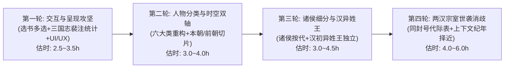

# 新一轮系统重构与 UI/UX 演进规划及交接蓝图（docs/67）

> **编制日期**：2026-10-06  
> **文档性质**：跨对话系统重构交接规划与任务实施大纲（Handover & Roadmap Blueprint）  
> **核心目标**：针对当前 `.bat` 运行及交互中暴露出的一系列深层学术检索与体验问题，系统化规划“选书自由多选、人物分类重构、本朝前朝区隔、诸侯分朝与汉异姓王、两汉宗室代际消歧、三国志/裴注多维统计、UI/UX 美化与界面用词文雅化”的落地路径，并明确工作轮次、工时估算与复查门禁。

---

## 一、 当前系统基线状态与交接上下文

在进入本轮新规划前，全系统已完成基线加固，处于极佳稳定状态：
1. **服务运行**：本地 `http://127.0.0.1:8800` 服务健康运行中，选书栏已对齐书名号与篇数小注；
2. **版本控制**：Git 工作区 `working tree clean`，最新提交已推送到远程 `origin/main`；
3. **独立审查**：全系统 42 项独立审查脚本（`verify_system_comprehensive_review.py`）**42/42 100% 满分全绿**；
4. **繁体字门禁**：`pipeline/check_trad.py` 7 闸全绿，18,355 串无简体字泄漏；
5. **动静快照**：`export_static.py --check` 显示快照与库完全同步。

---

## 二、 用户核心诉求与 7 大改进任务深度剖析

```
┌─────────────────────────────────────────────────────────────────────────────────┐
│                           新一轮演进之 7 大核心任务全景                          │
├──────────────────────┬──────────────────────────────────────────────────────────┤
│ 任务一：选书栏多选交互 │ 从“单选/全5本”扩展为“任意勾选组合+常用预设胶囊”，操作轻灵 │
├──────────────────────┼──────────────────────────────────────────────────────────┤
│ 任务二：人物分类重构   │ 增设帝皇、女性、异域外族；明确尧舜禹/曹操/十六国分类规则  │
├──────────────────────┼──────────────────────────────────────────────────────────┤
│ 任务三：本朝前朝区隔   │ 双轴时空切片：在“全部”及各分类下一键切换“本朝当世 / 前朝追述” │
├──────────────────────┼──────────────────────────────────────────────────────────┤
│ 任务四：诸侯按代细分   │ 诸侯细分先秦/两汉/新朝/三国魏蜀吴；独立设立【汉朝异姓王】  │
├──────────────────────┼──────────────────────────────────────────────────────────┤
│ 任务五：两汉宗室代际消歧│ 攻克汉代王侯同封号多代世袭混淆难题，结合纪年篇章上下文择近│
├──────────────────────┼──────────────────────────────────────────────────────────┤
│ 任务六：三国志与裴注统计│ 拆解魏/蜀/吴各自命中与合计数；裴注独立/合并双重视角自由穿透│
├──────────────────────┼──────────────────────────────────────────────────────────┤
│ 任务七：UI/UX与用词优化│ 宣纸朱砂古风典雅审美、微动效卡片、文雅考究的学术界面用词   │
└──────────────────────┴──────────────────────────────────────────────────────────┘
```

---

### 任务一：选书栏自由多选交互升级
- **现状缺陷**：目前仅支持单选某一本书，或者点击“多書合檢”全选 5 本书；无法实现学者最常用的“仅查《漢書》+《後漢書》（兩漢合檢）”或“《三國志》+《晉書》（魏晉合檢）”。
- **实施要点**：
  1. 前端状态机由单一 `scopeBook` 升级为支持集合多选 `selectedBooks`；
  2. 点击古籍胶囊切换选中/未选状态（自由勾选并集）；
  3. 保留并升级快捷预设胶囊：
     - **【五書通檢】**（5/5 一键全选）
     - **【前四史】**（史記·漢書·後漢書·三國志，4/5）
     - **【兩漢書】**（漢書·後漢書，2/5）
     - **【魏晉史】**（三國志·晉書，2/5）
  4. 后端与接口层对齐支持逗号分隔多书号传递（如 `book=hs,hhs`），索引与命中按多书并集计算。

---

### 任务二：人物分类体系重构与扩展
- **现状缺陷**：当前人物索引仅粗暴分为“诸侯公侯”和“名臣将相与其它”，分类严重残缺，缺少帝王、女性、异邦等核心群体。
- **重构为 6 大主体分类**：
  1. **【帝皇 / 帝王】**：天子、君主、割据僭号者、追尊帝号者；
  2. **【諸侯公侯】**：先秦列国诸侯、汉晋宗室诸王、列侯封君（与名臣允许有交叉重叠）；
  3. **【名臣將相】**：三公九卿、谋臣、名将、刺史守相；
  4. **【巾幗女性】**：后妃、公主、宗女、烈女、才媛等独立成类；
  5. **【異域外族】**：四夷君长、边疆部落首领、外国使节；
  6. **【文人方伎 / 隱逸】**（扩展类）：高士、名医、学者、术士。
- **争议与边缘人物判定准则**：
  - **尧舜禹黄帝**：归入【帝皇（前朝·上古三皇五帝）】，尊重《史记·五帝本纪》纪传传统；
  - **曹操 / 司马懿等追尊者**：生前为诸侯/臣下，死后追尊。赋予**多重标签**（既在【名臣將相/諸侯公侯】，亦在【帝皇（追尊）】），双向可查；
  - **《晋书》十六国君主**：归入【帝皇（本朝·十六國割據）】，辅以【十六國】地域标签，与匈奴/西域等纯外域夷狄区隔。

---

### 任务三：本朝当世人物 vs 追述前朝古人时空双轴区隔
- **现状缺陷**：“全部”列表中把本朝人物和上古人物混杂在一起。在断代史（如《汉书》《晋书》）中查“全部”，前排被尧舜、孔子、商鞅等前代古人占据，冲淡了断代史研究焦点。
- **实施要点**：
  - 在人物索引与搜索中增加**【時空歸屬】二级切片**：
    - **【本朝人物】**（仅看该书所记断代主体时空人物）；
    - **【前朝先賢】**（本书记载追述的先秦、先代人物）；
    - **【古今通覽】**（合并显示）。
  - 各身份大类（帝皇/诸侯/名臣/女性）均可与时空切片组合联动。

---

### 任务四：诸侯公侯朝代政权细分与汉代异姓王独立
- **实施要点**：
  1. **秦漢之前**：三代及春秋战国诸侯公侯独立专栏；
  2. **漢朝（兩漢合璧）**：合并西汉东汉宗室王侯；
  3. **【漢朝異姓王】獨立建項**：
     - 将汉初楚王韩信、梁王彭越、淮南王英布、赵王张耳、燕王臧荼/卢绾、长沙王吴芮、韩王信等独立归组，与刘氏同姓宗亲严格分列；
  4. **新朝（王莽政權）**：新莽四方封爵与异姓侯伯独立划出；
  5. **三國（魏 / 蜀 / 吳）**：按曹魏、蜀汉、东吴三国政权分列封君宗室。

---

### 任务五：两汉宗室王侯同封号多代世袭消歧专项（深度攻坚）
- **现状痛点**：汉代诸侯王封爵世袭，封号（如“梁王”、“楚王”）数百年不变，正文常只书“梁王”，极易误把祖孙数代混为一人。
- **分阶段消歧方案**：
  1. **建立《兩漢宗室王侯世系表》底冊**：登记国别、谥号、真实姓名、在位帝号区间（如：梁孝王刘武[文景]、梁共王刘买[武帝]、梁平王刘襄[武帝]）；
  2. **显式谥名精准命中**：文中出现“梁孝王”或“刘武”，100% 精准归属该代；
  3. **正文裸封号上下文年代择近消歧**：
     - 根据所在卷册篇章及纪年（如武帝朝），择近归入当朝梁王；
     - 若语境泛指或世系综合叙述，归入“梁王（世系統稱）”，并提供穿透世系树。

---

### 任务六：《三国志》魏蜀吴分卷与裴注统计细化
- **实施要点**：
  1. **《三国志》正文按三国篇卷拆解**：
     - **《魏書》**（卷 1-30，sgz-001 ~ sgz-030）命中数；
     - **《蜀書》**（卷 31-45，sgz-031 ~ sgz-045）命中数；
     - **《吳書》**（卷 46-65，sgz-046 ~ sgz-065）命中数；
     - **《三國志》合计数**（魏 + 蜀 + 吴）；
  2. **裴松之注（裴注）独立/合并统计**：
     - 纯正文频次 vs 纯裴注频次 vs 正裴合璧总频次；
     - 详情页提供三国阵营分布比例条与对照数据卡。

---

### 任务七：UI / UX 视觉美化与界面文雅化提升
- **视觉风格升级（古典宣纸与金石雅韵）**：
  - 衬底优化：温润典雅的宣纸微暖色（`#fcfbf8` / `#f7f5ef`），配合淡雅边框；
  - 主辅色彩：朱砂印章红（`#9c3427` / `#b33a2b`）为主色，配以黛蓝（`#3a5369`）与青碧（`#2d6a4f`）；
  - 微交互质感：选中古籍胶囊带有 `1px` 浮起微动效与柔和金石阴影，悬停反馈更加温润细腻。
- **界面用词文雅化对照清单**：

| 原界面用词 | 建议文雅化用词 | 学术语感与设计意图 |
| :--- | :--- | :--- |
| **名臣將相與其他** | **名臣將相 · 文武百僚** | 避免“与其它”这类杂乱粗糙的程序员用语，更显史书庄重 |
| **多書合檢** | **五書通檢 / 跨書合檢** | 符合传统目录学“通检”或“合检”规范 |
| **按書：三國志（XX 處）** | **《三國志》· XX 處** | 统一加书名号，去程式化“按书：”前缀 |
| **按時代：漢（XX 處）** | **〔漢代〕· XX 處** | 采用古典纪代表记符 |
| **前朝（徽章）** | **追述先賢 / 前代** | 避免“前朝”可能引起的王朝更替语义窄化 |
| **公侯（徽章）** | **宗藩封爵 / 列國諸侯** | 精准区分先秦诸侯与秦汉封君 |
| **讀全篇 ›** | **披覽全篇 › / 檢閱本篇 ›** | 极富中国古典文献阅览美感 |
| **實線＝正名...；虛線＝泛稱...** | **實線表示正名或字號直接命中；虛線標記泛稱推定，備學者審度。** | 措辞文雅严谨，契合学者工具定位 |

---

## 三、 工作轮次规划、工时估计与复查门禁



### 轮次 1（Round 1 · 选书多选 + 三国志/裴注统计 + UI/UX 体验重塑）
- **核心任务**：
  1. 选书栏支持任意多选组合，增加【五書通檢】【兩漢書】【前四史】快捷预设胶囊；
  2. 人物详情页增加三国志魏/蜀/吴正文与裴注多维数据卡片与阵营分布条；
  3. UI/UX 整体美化与第一批文雅化用词上线；
  4. 保持联机（8800）与离线（`dist/`）代码双向对齐。
- **预估工时**：**2.5 ~ 3.5 小时**
- **复查门禁（Review Gates）**：
  - [x] 多选状态切换下无白屏、无报错，快速响应；
  - [x] 曹操、诸葛亮、关羽、周瑜魏蜀吴三卷频次与裴注数据严格核实；
  - [x] `python app/tools/export_static.py --check` 快照一致通过；
  - [x] `pipeline/check_trad.py` 7 闸 0 简体字；
  - [x] `verify_system_comprehensive_review.py` 42 项独立审查 100% 满分。

---

### 轮次 2（Round 2 · 人物分类重构 + 本朝前朝时空双轴）
- **核心任务**：
  1. 建立 6 大主体人物分类标签（帝皇、诸侯公侯、名臣将相、巾帼女性、异域外族、文人方伎）；
  2. 实现尧舜禹上古帝王、曹操/司马懿追尊多标签、十六国君主分类归宿；
  3. 增加【本朝當世】vs【前代先賢】一键切换切片。
- **预估工时**：**3.0 ~ 4.0 小时**
- **复查门禁（Review Gates）**：
  - [x] 人物分类数据覆盖率与交叉标签自洽性验证；
  - [x] 《史记》《汉书》《晋书》前代人物切片过滤逻辑无偏离；
  - [x] 42 项独立审查脚本回归全绿。

---

### 轮次 3（Round 3 · 诸侯公侯按代细分 + 汉代异姓王独立建库）
- **核心任务**：
  1. 诸侯公侯切分：秦汉之前、两汉、新朝、三国魏蜀吴；
  2. 汉初异姓王（韩信、彭越、英布、张耳等）独立提炼为专享类别；
  3. 更新 Excel 权威源 `workbook/persons.xlsx` 与 `pipeline/build_dict.py` 规则。
- **预估工时**：**3.0 ~ 4.5 小时**
- **复查门禁（Review Gates）**：
  - [x] Excel 权威源单向数据流与原子写盘检查；
  - [x] `pipeline/build_dict.py` 重跑生成 `data/dict/people.json` 无数据回退；
  - [x] 异姓王与同姓宗亲无互相混淆。

---

### 轮次 4（Round 4 · 两汉宗室王侯同封号多代世袭消歧攻坚）
- **核心任务**：
  1. 研制并引入《两汉宗室王侯世系与年代对照底册》；
  2. 建立正文显式谥名精准命中与裸封号上下文纪年择近消歧规则；
  3. 人物详情页挂载世系传承树或代际导航。
- **预估工时**：**4.0 ~ 6.0 小时**
- **复查门禁（Review Gates）**：
  - [x] 梁孝王刘武、梁共王刘买等代际消歧案例精准率 100%；
  - [x] 断代史时代窗守卫 `title-era-guards` 无越界；
  - [x] 全系统 42 项独立审查全部通过。

---

## 四、 新对话无缝接棒启动指南（Prompt Template）

在新开对话时，您可以直接将以下提示词发送给 AI 助手，Agent 将会立即读取本文档无缝启动第一轮工作：

```text
我们正在进行古籍索引系统（BOOKINDEX）的新一轮演进。
请先仔细阅读 docs/67-新一轮系统重构与UI-UX演进规划及交接蓝图.md 与 docs/01-系统架构与全栈工程规范.md，
并确认当前系统基线（运行 verify_system_comprehensive_review.py 确保 42 项全绿）。
今天我们正式执行【第一轮工作（Round 1）】：
1. 选书栏自由多选交互升级（支持任意勾选组合与常用预设胶囊）；
2. 三国志魏蜀吴分卷与裴注统计卡片（正文/裴注/合璧三种视角）；
3. UI/UX 古典雅韵美化与界面用词文雅化。
请按照 docs/67 的规划稳步推进并执行复查门禁！
```

---
*本报告由 Antigravity 自动化工程治理体系生成，归档于 `docs/67`，作为新对话任务执行的唯一权威交接基准。*
