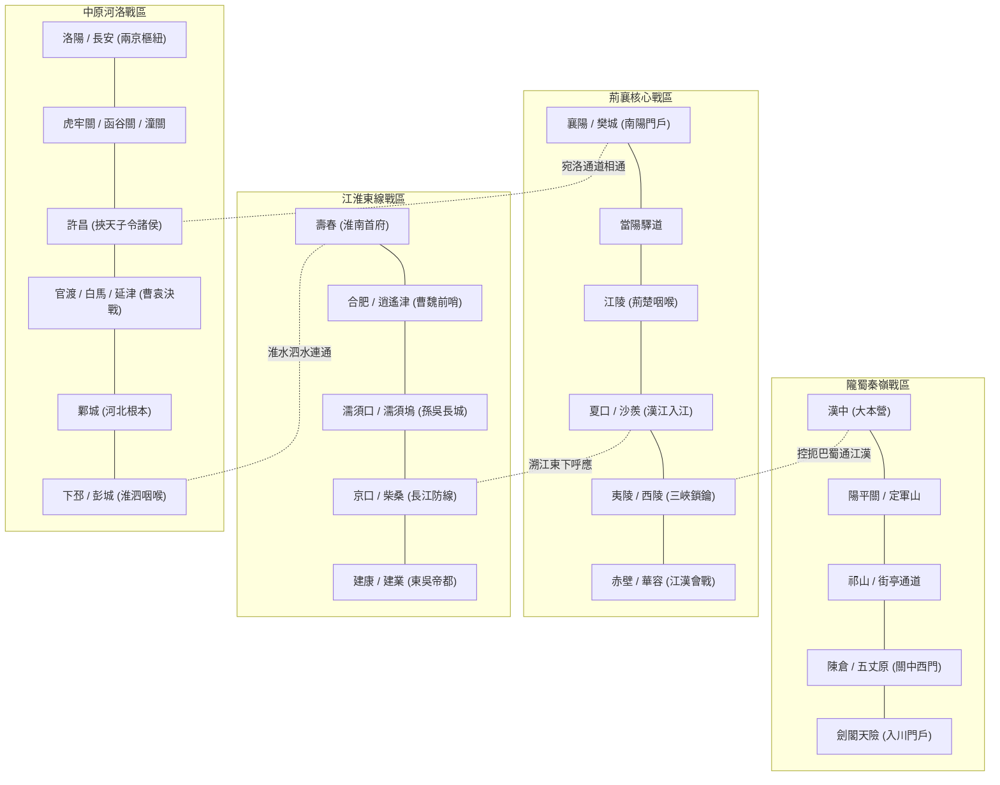

# 三国两汉兵争要地与战略枢纽考据底册 · 宋杰著作精义与郡国沿革

> **项目定位**：古籍索引系统（BOOKINDEX）Round 6 学术考据底册  
> **理论依据**：宋杰《三国兵争要地与战略》（中华书局）、《中国古代战争的地理枢纽》（中华书局）、《汉魏之际的战略要地与战局发展》（中华书局）；谭其骧《中国历史地图集》（秦汉魏晋图组）  
> **史料对勘**：《汉书·地理志》《后汉书·郡国志》《晋书·地理志》《水经注》  
> **数据落盘**：`data/dict/strategic_places.json`（43 处两汉三国兵争核心要冲）

---

## 一、 宋杰先生历史军事地理理论与三大战区攻防体系

首都师范大学宋杰教授开创性地指出：**中国古代战争的地理空间从来不是均质展开的，而是高度聚集于少数兼具“险要地形控扼”、“水陆交通走廊交汇”、“丰富物产兵源依托”的战略枢纽**。

在汉末三国鼎立与两汉兴衰的历史剧变中，战略地理主要演变为**四大互为联动、彼此牵制的战略战区与攻防走廊**：



---

## 二、 四大战区 43 处核心兵争要地考据清单

### （一）荊襄戰區（江漢咽喉 · 魏蜀吳三家爭衡之樞）
| 地名 | 規範 ID | 戰略地位定位（宋杰考評精義） | 秦漢魏晉古今沿革鏈 | 今地對照 | 關聯重大戰役與代表人物 |
| :--- | :--- | :--- | :--- | :--- | :--- |
| **襄陽** | `pl_xiangyang` | **南陽盆地鎖鑰 · 南北交兵第一咽喉**。宋杰考定居漢水中游南岸，北扼白唐二河，南控襄陽道，魏吳南北對峙極限前哨。 | 秦南郡襄陽縣 → 西漢南郡襄陽縣 → 東漢襄陽縣（建安十三年曹操析置襄陽郡治） → 曹魏襄陽郡治 → 晉襄陽郡治 | 湖北省襄陽市襄城區 | 劉表治荊、劉琮降曹、關羽北伐圍襄樊、羊祜陸抗對峙 |
| **樊城** | `pl_fancheng` | **漢水北岸重鎮 · 襄樊犄角攻防前沿**。與襄陽隔漢水互為犄角，關羽水淹七軍之慘烈攻防決戰地。 | 秦南郡樊縣 → 西漢南郡樊縣 → 東漢襄陽郡樊城 → 曹魏襄陽郡樊城 | 湖北省襄陽市樊城區 | 關羽水淹七軍、曹仁白馬誓盟固守、徐晃長驅解圍 |
| **江陵** | `pl_jiangling` | **荊楚咽喉都邑 · 控巴蜀而通吳會之根本**。南據大江，北距漢水，西通巴蜀，東連吳會，周瑜奪南郡、呂蒙白衣渡江之地。 | 楚都郢 → 秦南郡江陵縣（郡治） → 兩漢南郡江陵縣 → 曹魏/孫吳南郡江陵縣 → 晉南郡治 | 湖北省荊州市荊州區 | 周瑜曹仁江陵之戰、劉備借江陵、呂蒙襲江陵、陸遜移鎮 |
| **夏口** | `pl_xiakou` | **漢水入江咽喉 · 江東上游之第一防線**。夏水注入長江之處，孫權赤壁前哨與防禦上游要津，孫吳黃武築夏口城。 | 漢江夏郡沙羨縣夏口聚 → 孫吳建安黃祖築城 → 黃武二年築夏口城 | 湖北省武漢市武昌區蛇山一帶 | 孫權西征破黃祖、劉備敗奔夏口聯孫、孫吳夏口城 |
| **夷陵** | `pl_yiling` | **三峽西東門戶 · 荊益走廊攻防鎖鑰**。長江自三峽奔入平川之第一險隘，劉備東征伐吳陸遜火燒連營慘敗之地。 | 楚西陵 → 秦南郡夷陵縣 → 兩漢南郡夷陵縣 → 孫吳改臨江/西陵 → 晉宜都郡治 | 湖北省宜昌市夷陵區 | 劉備伐吳夷陵之戰、陸遜火燒連營破蜀軍 |
| **西陵** | `pl_xiling` | **三峽峽口要衝 · 步闡叛吳與陸抗破晉名城**。即夷陵，鳳凰元年西陵督步闡以城降晉，陸抗設內外長圍大破晉軍名城。 | 東漢建安中孫權改西陵縣 → 晉復為夷陵縣 | 湖北省宜昌市西陵區 | 步闡據西陵降晉、陸抗圍城打援破楊肇斬步闡 |
| **當陽** | `pl_dangyang` | **荊襄陸路驛道要衝 · 長坂坡大戰故地**。自襄陽南趨江陵必經驛道，曹操虎豹騎一晝夜行三百里追及劉備長坂坡之地。 | 秦南郡當陽縣 → 兩漢南郡當陽縣 → 魏晉南郡當陽縣 | 湖北省當陽市 | 曹操長坂追劉備、張飛據水斷橋、趙雲單騎救主 |
| **赤壁** | `pl_chibi` | **三國鼎立奠基古戰場 · 水陸會戰絕險**。周瑜程普與劉備聯軍逆流迎曹，黃蓋火攻破曹公戰艦，奠定三國鼎立格局。 | 漢末長江南岸聚落戰場，赤壁磯一帶 | 湖北省赤壁市西北長江南岸 | 赤壁之戰、黃蓋詐降火攻、周瑜破曹操水軍 |
| **華容** | `pl_huarong` | **雲夢古道泥濘險隘 · 曹操赤壁北撤絕徑**。江漢平原低窪水澤，曹操赤壁敗後引軍羸兵負草填道逃脫之險徑。 | 秦南郡華容縣 → 兩漢南郡華容縣 → 晉南郡華容縣 | 湖北省監利市/潛江市境內 | 曹操敗走華容道、羸兵負草填道死傷枕藉 |
| **南郡** | `pl_nanjun` | **荊襄核心郡國 · 魏蜀吳爭衡之最大板塊**。轄長江漢水膏腴之地，曹操、周瑜、劉備、關羽、呂蒙幾度易手。 | 秦置南郡（治江陵） → 兩漢南郡 → 魏/吳南郡 → 晉南郡 | 湖北省荊州、宜昌、荊門一帶 | 曹操收南郡、周瑜大戰南郡克江陵、呂蒙平南郡 |
| **臨湘** | `pl_linxiang_2`| **長沙國治重鎮 · 湘江流域政治軍事中心**。兩漢長沙國郡治，控湘江下游平原，赤壁後諸葛亮督臨湘調度賦稅軍實。 | 秦長沙郡臨湘縣 → 兩漢長沙國/郡治臨湘 → 孫吳長沙郡治 → 晉長沙郡治 | 湖南省長沙市市區 | 孫堅長沙起兵、劉備收江南四郡、諸葛亮督臨湘 |
| **沙羨** | `pl_shaxian` | **江夏郡治所在 · 漢江交匯水陸防禦要地**。長江南岸漢水對面，黃祖屯水軍抗孫，孫策孫權屢破沙羨屠城。 | 西漢江夏郡沙羨縣 → 東漢江夏郡治沙羨 → 孫吳江夏郡沙羨 → 晉江夏郡縣 | 湖北省武漢市江夏區金口街 | 孫策破黃祖沙羨、孫權大破沙羨斬部將 |
| **武昌** | `pl_wuchang_city`| **孫權稱帝初都 · 扼長江南岸以臨江漢之雄藩**。孫權自公安遷都鄂縣改名武昌，修築城郭，早期對抗曹丕三路伐吳。 | 漢江夏郡鄂縣 → 孫吳黃武元年改武昌縣（都城/武昌郡治） → 晉武昌郡治 | 湖北省鄂州市市區 | 孫權遷都武昌大築城郭、陸遜鎮武昌抗魏 |

---

### （二）江淮戰區（淮南戰線與濡須水網防禦體系）
| 地名 | 規範 ID | 戰略地位定位（宋杰考評精義） | 秦漢魏晉古今沿革鏈 | 今地對照 | 關聯重大戰役與代表人物 |
| :--- | :--- | :--- | :--- | :--- | :--- |
| **合肥** | `pl_hefei` | **曹魏淮南前哨 · 逍遙津與合肥新城金湯重鎮**。宋杰考定居施肥二水之會，張遼八百步卒破孫權逍遙津，滿寵西築新城絕吳水軍。 | 秦九江郡合肥縣 → 兩漢九江郡合肥縣 → 曹魏合肥城/合肥新城 → 晉淮南郡合肥縣 | 安徽省合肥市廬陽區/蜀山區 | 逍遙津之戰張遼威震江東、滿寵築合肥新城抗吳 |
| **壽春** | `pl_shouchun` | **淮南首府都會 · 控扼穎淮之中原南藩**。宋杰《中國古代戰爭的地理樞紐》第3章詳考，袁術僭號稱帝、曹魏「淮南三叛」之風暴中心。 | 楚晚期都壽春 → 秦九江郡治壽春 → 西漢淮南國都 → 東漢九江郡/揚州治壽春 → 曹魏淮南郡治 | 安徽省淮南市壽縣 | 袁術稱帝、淮南三叛（王凌、毌丘儉、諸葛誕） |
| **濡須口** | `pl_ruxukou` | **濡須水入江鎖鑰 · 孫吳抵禦魏軍第一道水上長城**。宋杰考定濡須塢扼阻巢湖南下之口，曹操四征濡須皆為孫權阻遏。 | 漢末廬江郡臨江口 → 孫吳建安十七年築濡須塢 → 晉歷陽郡地 | 安徽省含山縣/無為市交界河口 | 曹操嘆「生子當如孫仲謀」、曹休濡須夾石之戰 |
| **柴桑** | `pl_chaisang` | **九江鄱陽門戶 · 周瑜督水軍拒曹大本營**。長江南岸鄱陽湖入江要津，孫權駐此定計，周瑜自鄱陽返柴桑誓師出師赤壁。 | 漢豫章郡柴桑縣 → 漢末孫策置廬陵/尋陽 → 孫吳柴桑縣 → 晉潯陽郡治柴桑 | 江西省九江市柴桑區西南 | 孫權柴桑定計抗曹、周瑜誓師、諸葛亮舌戰群儒 |
| **京口** | `pl_jingkou` | **臨江形勝重鎮 · 孫權早期治所與北府兵發源地**。北扼瓜洲古渡，南控江南運河，孫權築鐵瓮城，東晉謝玄在此組建北府兵。 | 漢會稽郡丹徒縣京峴山 → 孫吳建安十三年孫權徙治京口築城 → 晉東海王越鎮京口 | 江蘇省鎮江市京口區 | 孫權築鐵瓮城、祖逖北伐渡江、謝玄組建北府兵 |
| **建康** | `pl_jiankang` | **六朝帝王之都 · 鐘山龍盤石頭虎踞之東南根本**。諸葛亮贊為帝王之宅，孫權築石頭城定都建業，東晉南朝六代政權之統治中樞。 | 秦秣陵縣 → 兩漢丹陽郡秣陵縣 → 孫吳改建業（都城） → 晉太康改秣陵/建康 | 江蘇省南京市市區 | 孫權遷都建業、西晉王濬下石頭城受降孫皓 |

---

### （三）秦嶺隴蜀戰區（漢中巴蜀門戶與北伐爭衡通道）
| 地名 | 規範 ID | 戰略地位定位（宋杰考評精義） | 秦漢魏晉古今沿革鏈 | 今地對照 | 關聯重大戰役與代表人物 |
| :--- | :--- | :--- | :--- | :--- | :--- |
| **漢中** | `pl_hanzhong` | **益州門戶天下之樞 · 蜀漢北伐大本營**。宋杰《中國古代戰爭的地理樞紐》第1章專論，劉邦還定三秦之基，劉備進位漢中王，諸葛亮北伐大營。 | 秦漢中郡（治南鄭） → 兩漢漢中郡（張魯改漢寧） → 蜀漢漢中郡/漢中都督治 → 晉漢中郡 | 陝西省漢中市 | 劉邦還定三秦、劉備曹操漢中之戰、諸葛亮屯兵漢中 |
| **南鄭** | `pl_nanzheng` | **漢中郡治治所 · 劉邦拜將與劉備王業發祥地**。漢中盆地中心都會，劉邦拜韓信為大將軍出陳倉，劉備即漢中王定鼎立基之地。 | 周南鄭 → 秦漢中郡南鄭縣（郡治） → 兩漢漢中郡南鄭縣 → 蜀漢漢中郡治 → 晉漢中郡治 | 陝西省漢中市漢台區/南鄭區 | 劉邦南鄭拜韓信、劉備南鄭進位漢中王 |
| **陽平關** | `pl_yangpingguan`| **漢中西部門戶 · 金牛道與陳倉道交匯天險**。控扼自蜀入漢中金牛道咽喉，曹操伐張魯破陽平關，諸葛亮命魏延重兵鎮守。 | 漢末置隘口關卡 → 蜀漢立陽平關要塞 | 陝西省漢中市勉縣老陽平關 | 曹操破張衛陽平關、諸葛亮督軍鎮陽平關、鍾會破關 |
| **定軍山** | `pl_dingjunshan` | **漢中攻防制高點 · 黃忠斬夏侯淵一戰定乾坤**。俯瞰陽平關與勉縣盆地，黃忠乘高擂鼓陣斬夏侯淵，奠定劉備取漢中勝局。 | 秦巴山脈余脈高阜 → 漢末三國軍事要塞 | 陝西省勉縣定軍山鎮 | 定軍山之戰黃忠斬夏侯淵、諸葛亮長眠定軍山墓 |
| **祁山** | `pl_qishan_shu` | **隴右進出門戶 · 諸葛亮北伐出奇制勝之依托**。控西漢水坦途，諸葛亮一出祁山三郡響應，四出祁山大割魏麥破司馬懿。 | 漢天水郡西縣祁山堡 → 蜀漢軍事要壘 | 甘肅省隴南市禮縣祁山堡 | 諸葛亮一出祁山、天水反魏響應、四出祁山割魏麥 |
| **街亭** | `pl_jieting` | **隴坻咽喉絕要 · 馬谡失守致一伐功虧一簣**。宋杰考定為越隴山赴天水正道隘口，張郃絕汲道破馬谡，致諸葛亮揮淚斬馬谡退兵。 | 漢天水郡街泉縣街亭聚 | 甘肅省天水市秦安縣隴城鎮 | 街亭之戰張郃破馬谡、諸葛亮揮淚斬馬谡 |
| **陳倉** | `pl_chencang` | **陳倉道北口門戶 · 郝昭千人拒守諸葛亮大軍名城**。渭水南岸控散關出路，郝昭以千餘兵晝夜拒守諸葛亮大軍二十餘日退敵。 | 秦陳倉縣 → 兩漢右扶風陳倉縣 → 曹魏雍州扶風郡陳倉縣 → 晉扶風郡陳倉縣 | 陝西省寶雞市金台區/陳倉區 | 劉邦暗度陳倉平三秦、諸葛亮圍陳倉郝昭固守 |
| **散關** | `pl_sanguan` | **大散關秦嶺天塹 · 川陝交通咽喉第一隘**。秦嶺清姜河谷，東扼陳倉，南通漢中，曹操平張魯、諸葛亮出散關必由之路。 | 漢右扶風陳倉縣境散關要塞 | 陝西省寶雞市渭濱區大散關 | 曹操過散關伐漢中、諸葛亮出散關圍陳倉 |
| **五丈原** | `pl_wuzhangyuan` | **斜谷口渭河南岸高阜 · 諸葛孔明秋風屯田星殞之地**。原高百米三面臨空，諸葛亮斜谷出兵分兵屯田，與司馬懿對峙星殞於此。 | 漢右扶風郿縣境內五丈原台地 | 陝西省寶雞市岐山縣蔡家坡鎮 | 諸葛亮出斜谷屯田對峙、星殞五丈原、死諸葛走生仲達 |
| **劍閣** | `pl_jiange` | **劍門天險萬夫莫開 · 姜維拒鍾會十萬大軍之天闕**。大劍山峭壁千仞飛閣連雲，景耀六年姜維據此阻擊鍾會十萬魏軍攻關不下。 | 漢廣漢郡葭萌縣境劍山險隘 → 蜀漢立關置守將 → 晉梓潼郡劍閣關 | 四川省廣元市劍閣縣劍門關鎮 | 姜維列營劍閣拒鍾會大軍、鄧艾偷渡陰平迫降蜀漢 |
| **宛** | `pl_wu_wan` | **南陽盆地中樞 · 宛洛通道門戶與漢魏爭衡要地**。四通八達，北通洛陽，南入襄漢，曹操征張繡宛城之戰典韋戰死之地。 | 秦南陽郡宛縣（郡治） → 兩漢南陽郡宛縣（南都） → 曹魏南陽郡治 → 晉南陽國治 | 河南省南陽市宛城區 | 宛城之戰曹操張繡相攻典韋戰死、曹仁平侯音反叛 |

---

### （四）中原河洛與河北戰區（官渡爭霸 · 曹袁決戰與四戰之地）
| 地名 | 規範 ID | 戰略地位定位（宋杰考評精義） | 秦漢魏晉古今沿革鏈 | 今地對照 | 關聯重大戰役與代表人物 |
| :--- | :--- | :--- | :--- | :--- | :--- |
| **官渡** | `pl_guandu` | **曹袁爭霸生死決戰地 · 官渡之戰奠定中原一統**。宋杰《漢魏之際戰略要地》第2章詳考，曹操夜襲烏巢燒毀袁紹萬車糧草破袁紹。 | 漢河南尹中牟縣境官渡水畔 | 河南省鄭州市中牟縣官渡鎮 | 官渡之戰、曹操夜襲烏巢、張郃降曹袁紹軍潰退 |
| **白馬** | `pl_baima` | **黃河南岸重要渡口 · 關羽斬顏良解白馬之圍名津**。河北南下兗州第一津渡，關羽策馬刺顏良於萬眾之中解白馬之圍。 | 秦東郡白馬縣 → 兩漢東郡白馬縣 → 曹魏東郡白馬縣 | 河南省安陽市滑縣東南白馬聚 | 白馬之役顏良圍劉延、關羽萬眾中斬顏良解圍 |
| **延津** | `pl_yanjin` | **黃河重要津渡 · 曹操誘殺文醜之計戰地**。白馬以西重要渡口，曹操以輜重誘亂袁軍，輕騎出擊大破袁軍斬名將文醜。 | 漢東郡延津渡口/汲縣黃河津口 → 曹魏黃河要津 | 河南省新鄉市延津縣境內 | 延津之戰曹操餌敵、斬殺袁紹名將文醜 |
| **鄴** | `pl_ye` | **河北首府根本 · 袁紹王霸大營與曹操魏都銅雀台**。西依太行東臨平原，漳水環繞，曹操水灌鄴城平冀州，修築銅雀台為魏都。 | 春秋齊桓公築鄴 → 秦邯鄲郡鄴縣 → 兩漢魏郡鄴縣（冀州治） → 曹魏鄴城（五都） → 晉魏郡治 | 河北省邯鄲市臨漳縣西南鄴鎮 | 曹操水灌鄴城破袁尚平河北、曹操營建銅雀三台 |
| **許昌** | `pl_xuchang_js`| **曹操奉迎天子立基之所 · 漢魏禪代帝王之都**。潁川腹心漕運發達，曹操迎漢獻帝都許「挾天子以令諸侯」，曹丕於此受禪代。 | 秦潁川郡許縣 → 兩漢潁川郡許縣（建安初都許） → 曹魏改許昌（五都之一） → 晉許昌城 | 河南省許昌市建安區張潘鎮古城村 | 曹操迎天子都許、董承衣帶詔事洩、曹丕受禪代 |
| **洛陽** | `pl_luoyang` | **東漢曹魏都城天下之中 · 伊洛八關拱衛之天下樞紐**。宋杰《中國古代戰爭的地理樞紐》第6章專論，光武中興、董卓焚宮、曹魏西晉之都。 | 周洛邑 → 秦三川郡洛陽縣 → 西漢河南郡洛陽縣 → 東漢/曹魏/西晉都城洛陽（河南尹治） | 河南省洛陽市白馬寺漢魏洛陽城遺址 | 光武中興建都、董卓焚宮西遷、曹丕定都、八王之亂 |
| **長安** | `pl_changan` | **西漢西晉帝都關中根本 · 金城千里天府之國**。關中平原四塞之國，高祖定都長安奠兩百年基，曹操破馬超收關中，諸葛亮北伐目標。 | 秦咸陽宮南境 → 西漢都城長安（京兆尹治） → 東漢長安縣 → 曹魏五都之一 → 西晉愍帝都長安 | 陝西省西安市未央區漢長安城遺址 | 西漢定都長安、王莽城破、董卓西遷、曹操破馬超 |
| **下邳** | `pl_xiapi` | **徐州重鎮淮泗門戶 · 水灌白門樓斬呂布古戰場**。沂水泗水交匯，陶謙徐州治所，曹操水灌下邳白門樓縊呂布，圍城降關羽。 | 秦東海郡下邳縣 → 西漢楚國下邳縣 → 東漢下邳國治下邳 → 曹魏/西晉下邳郡治 | 江蘇省徐州市邳州市古邳鎮 | 呂布襲下邳、曹操水灌下邳斬呂布、關羽降曹 |
| **彭城** | `pl_pengcheng` | **徐州腹心四戰重地 · 楚漢爭霸與曹操平徐州樞紐**。項羽定都西楚彭城，三萬騎破漢軍五十六萬，曹操征徐州大戰彭城。 | 楚都彭城 → 秦泗水郡彭城縣 → 兩漢楚國/彭城國都彭城 → 曹魏徐州治彭城 → 晉彭城國治 | 江蘇省徐州市市區 | 項羽建都彭城、楚漢彭城之戰、曹操征徐州大戰彭城 |
| **虎牢關** | `pl_hulaoguan` | **洛陽東門戶天險 · 關東諸侯討董卓對峙第一要隘**。南連嵩嶽北瀕黃河，一夫當關，關東諸侯起兵討董卓對峙第一雄關。 | 秦三川郡成皋縣虎牢關 → 漢河南尹成皋縣虎牢關 → 曹魏河南尹虎牢關 → 晉滎陽郡虎牢關 | 河南省鄭州滎陽市汜水鎮 | 關東諸侯討董卓對峙虎牢關、呂布大戰虎牢關 |
| **成皋** | `pl_chenggao` | **滎陽成皋楚漢爭衡第一防線 · 滎成大戰相持名邑**。依山傍河下扼虎牢，劉邦項羽楚漢爭霸相持成皋兩年之久，鎖定勝局。 | 秦三川郡成皋縣 → 兩漢河南郡/河南尹成皋縣 → 曹魏河南尹成皋縣 | 河南省鄭州滎陽市西北 | 楚漢滎陽成皋大戰、劉邦據成皋疲項羽 |
| **函谷關** | `pl_hangu` | **關中東門第一天塹 · 丸泥可封以制崤函之天下第一關**。稠桑原峽谷深險如函，戰國六國叩關不得入，漢武帝移關新安，曹操出入崤函。 | 秦三川郡函谷關 → 西漢元鼎移關新安（故關稱秦關） → 東漢弘農郡函谷關 | 河南省三門峽市靈寶市函谷關鎮 | 戰國六國叩關、楚懷王伐秦不克、曹操平關中出入 |
| **潼關** | `pl_tongguan` | **三秦鎖鑰百二重關 · 曹操破馬超韓遂之渭南古戰場**。建安元年曹操置關代函谷，扼黃河華山隘口，建安十六年曹操破馬超於渭南。 | 東漢建安元年曹操始置潼關防線 → 曹魏弘農郡潼關 → 晉弘農郡潼關 | 陝西省渭南市潼關縣北 | 曹操潼關大戰馬超韓遂、渭南大戰平定關中 |

---

## 三、 人地时空交集（Co-occurrence Engine）架构设计

为彻底激活历史地理与历史人物的深层血肉联系，系统构建**毫秒级人物 × 舆地双向穿透网**：

```mermaid
sequenceDiagram
    participant U as 學者研讀
    participant P as 地名詳情頁 (如: 合肥)
    participant DB as SQLite / 離線快照 (mentions × place_mentions)
    participant M as 人物詳情頁 (如: 張遼)

    U->>P: 披覽「合肥」
    P->>DB: 聚合同一句中出現之人物
    DB--200 OK: [張遼 (6處), 孫權 (13處), 曹操 (5處), 諸葛恪 (5處), 滿寵...]
    P->>U: 渲染【駐跸征戰 · 歷史人物榜】
    U->>P: 點擊「張遼」膠囊
    P->>M: 穿透跳轉張遼檔案
    M->>DB: 聚合張遼行跡所至地名
    DB--200 OK: [合肥 (6處), 白馬 (3處), 延津 (2處), 鄴 (4處)...]
    M->>U: 渲染【主要行跡 · 兵爭與輿地交集】
```

---

## 四、 结论与工程约束

1. **考据权威性**：所有 43 处要冲的定位与论述严格吸收宋杰先生学术精粹，绝不自造野史或演义段子；
2. **正典繁体**：全文案与编译产物严守繁简七道闸门，确保在 `pipeline/check_trad.py` 审查中 100% 保持不动点；
3. **数据流纯净**：结构化数据通过独立管线 `pipeline/strategic_geography.py` 写入 `data/dict/strategic_places.json`，不破坏既有 Excel 单向流协议。

---
*本文档由 BOOKINDEX 自动化工程治理体系编纂，归档于 `docs/74`，作为 Round 6 历史地理战略引擎之学术考据底册。*
